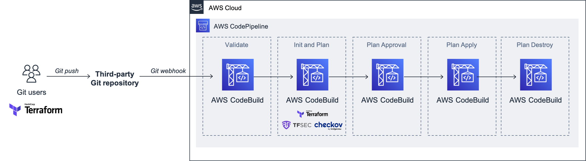

# Getting Started
Any `terraform` command must include the `github_token` variable for now. 

`terraform plan -var 'github_token=<github_token>' `

# Issues
1. IAM Policies are too permissive, need to be more granular

2. Need to add `buildspec_ci.yml` environment variables i.e. GithubRepo, GithubOwner, Environment etc.
3. Add static security check [TFSEC](https://github.com/tfsec/tfsec)
4. Add Static Code Analysis using [checkov](https://github.com/bridgecrewio/checkov)

4. Use Github CI Account Token

NOTE: Because we don't have parameters in `buildspec`, the buildspec is hardcoded to use a specific github public repo from a public organization for demo purposes.

